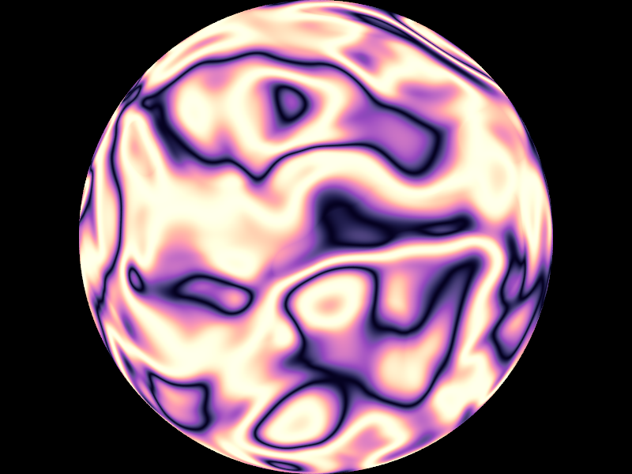

# POV-Ray-color-maps
Color maps for POV-Ray v3.7 from the Plasma, Inferno, Magma and Viridis color maps in Python's Matplotlib.

The include file Color_Maps.inc contains these color maps:

* ColorMap_Magma
* ColorMap_Inferno
* ColorMap_Plasma
* ColorMap_Viridis

Each color map has 256 color entries evenly distributed from 0 to 1.

Magma


Inferno


Plasma


Viridis


The color maps can be used like this:

```
color_map { ColorMap_Plasma }
```

The colors in the color maps are also available in these arrays:

* Colors_Magma
* Colors_Inferno
* Colors_Plasma
* Colors_Viridis

Also see the example files in the Example directory.

GitHub pages for the Matplotlib color maps:
* https://github.com/BIDS/colormap
* https://bids.github.io/colormap/

## Images created with the examples:

### Plasma

[Source code](Examples/Plasma.pov)\


### Inferno

[Source code](Examples/Inferno.pov)\


### Magma

[Source code](Examples/Magma.pov)\


### Viridis

[Source code](Examples/Viridis.pov)\

